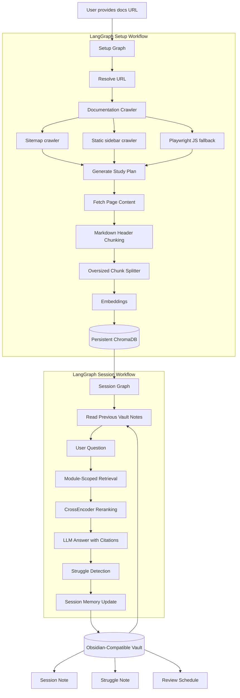

# VaultLearn

An agentic documentation learning system that turns live technical docs into structured study sessions, RAG answers, and Obsidian-compatible memory notes.

VaultLearn helps developers learn new frameworks directly from their official documentation. Give it a docs URL like `https://fastapi.tiangolo.com`, and it crawls the docs, creates a study plan, indexes the pages, answers questions with source-grounded context, detects what you struggled with, and writes session notes back to a local vault.

---

## Why I Built This

Official docs are useful, but they are not always easy to learn from.

When I learn a new framework, I usually need three things:

1. A clear path through the docs.
2. A way to ask questions from the actual documentation.
3. A memory system that remembers what I studied and where I struggled.

VaultLearn was built around that idea: not just a RAG chatbot over docs, but a learning loop that can continue across sessions.

---

## Demo Flow

```text
Paste docs URL
   ↓
Agent crawls and indexes documentation
   ↓
LLM generates a structured study plan
   ↓
Start an interactive study session
   ↓
Ask questions and get source-grounded answers
   ↓
System detects struggles during the session
   ↓
Session notes, struggle notes, and review schedule are written to vault
   ↓
Next session can read previous notes and continue from history
```

---

## Design Diagram



---

## What It Does

* Fetches live documentation at runtime.
* Crawls docs using sitemap, static sidebar, and Playwright fallback.
* Generates a structured study plan with modules, priorities, and estimated hours.
* Chunks pages using heading-aware Markdown splitting.
* Splits oversized chunks only when needed.
* Stores embeddings in persistent ChromaDB.
* Runs module-scoped RAG during study sessions.
* Reranks retrieved chunks with a CrossEncoder.
* Answers questions with source-grounded context.
* Detects when the learner struggles during a turn.
* Writes session notes, struggle notes, and review schedules to a local vault.
* Reads previous notes at the start of a new session for continuity.
* Provides a terminal-style React UI for interactive learning.

---

## Test Run

FastAPI documentation test:

| Metric                  | Value                          |
| ----------------------- | ------------------------------ |
| Docs URL                | `https://fastapi.tiangolo.com` |
| Pages crawled           | 152                            |
| Study modules generated | 6                              |
| ChromaDB chunks indexed | 3,493                          |
| Vector store            | Persistent ChromaDB            |

---

## Architecture Overview

VaultLearn has two separate LangGraph workflows.

### 1. Setup Graph

The setup graph runs once per topic or documentation URL.

It handles:

```text
URL resolution
→ docs crawling
→ study plan generation
→ page fetching
→ chunking
→ embedding
→ ChromaDB collection building
```

This avoids re-crawling and re-indexing the docs on every message.

### 2. Session Graph

The session graph runs during interactive Q&A.

It handles:

```text
read vault memory
→ receive user question
→ retrieve module-specific chunks
→ rerank chunks
→ generate answer
→ detect struggle
→ update session state
→ write vault notes
```

This separates the heavy indexing pipeline from the lightweight study session loop.

---

## Tech Stack

| Layer               | Technology                              |
| ------------------- | --------------------------------------- |
| Agent orchestration | LangGraph                               |
| Backend API         | FastAPI                                 |
| Frontend            | React + Vite                            |
| LLM provider        | Groq                                    |
| LLM models          | qwen3-32b, llama-3.3-70b, llama-4-scout |
| Embeddings          | HuggingFace all-MiniLM-L6-v2            |
| Reranker            | CrossEncoder ms-marco-MiniLM-L-6-v2     |
| Vector store        | ChromaDB                                |
| Doc fetching        | Jina Reader API, httpx                  |
| Crawling            | BeautifulSoup, Playwright               |
| Structured output   | Pydantic v2                             |
| Memory format       | Markdown notes, Obsidian-compatible     |

---

## Project Structure

```text
VaultLearn/
├── Backend/
│   ├── agent/
│   │   ├── graph.py           # Setup pipeline LangGraph
│   │   ├── session_graph.py   # Interactive session LangGraph
│   │   ├── nodes.py           # Node functions
│   │   └── state.py           # VaultLearnState
│   ├── memory/
│   │   └── vault.py           # Vault read/write logic
│   ├── rag/
│   │   ├── fetcher.py         # URL resolution + crawling
│   │   ├── chunker.py         # Page fetching + chunking
│   │   └── retriever.py       # ChromaDB + reranking
│   ├── schemas/
│   │   └── models.py          # Pydantic models
│   ├── api/
│   │   └── main.py            # FastAPI endpoints
│   ├── vault/                 # Generated markdown notes
│   ├── chroma_db/             # Persistent vector store
│   └── Dockerfile.backend
├── frontend/
│   ├── src/
│   │   └── App.jsx            # Terminal-style UI
│   └── Dockerfile
├── docker-compose.yml
└── README.md
```

---

## Key Design Decisions

### Why live docs instead of model knowledge?

LLM training data can be stale. VaultLearn fetches documentation at runtime so answers are based on the current docs, not whatever the model remembers.

### Why sitemap → sidebar → Playwright fallback?

Docs sites are inconsistent. Some expose a sitemap, some have static sidebar links, and some render navigation with JavaScript.

The crawler uses a fallback chain:

```text
sitemap.xml → static sidebar → Playwright-rendered links
```

This makes crawling more reliable across different documentation sites.

### Why heading-aware chunking?

Technical docs are structured around headings. Splitting by headings preserves meaning better than blindly splitting by character count.

VaultLearn first uses Markdown heading-based splitting, then applies a character splitter only to chunks that are too large.

### Why module-scoped retrieval?

During a study session, the user is usually working inside one module. Retrieval can be filtered by `module_number`, reducing unrelated context from other parts of the docs.

This helps avoid cross-module context bleed.

### Why CrossEncoder reranking?

Dense retrieval is fast, but it only ranks by vector similarity. A CrossEncoder scores the query and chunk together, which improves precision for technical documentation where exact wording matters.

### Why vault memory?

A normal chatbot forgets what happened after the session ends. VaultLearn writes session notes, struggle notes, and review schedules as Markdown files so learning can continue across sessions.

### Why two LangGraph workflows?

Setup and study sessions have different lifecycles.

The setup graph is heavy and runs once per topic. The session graph is lightweight and runs per user message.

Separating them avoids expensive re-indexing during normal Q&A.

---

## Vault Memory

After a session, VaultLearn writes three Markdown notes.

### 1. Session Note

Stores:

* topic
* date
* module covered
* messages exchanged
* key takeaways

### 2. Struggle Note

Stores:

* questions where the user struggled
* reason for struggle
* review flag

### 3. Review Schedule

Stores:

* topic
* struggle score
* next review date
* review reason

The next session can read these notes and use them as memory.

---

## Spaced Repetition Logic

VaultLearn calculates a simple struggle score:

```text
struggle_score = len(struggle_signals) / 10
```

The score is capped at `1.0`.

Review timing:

| Struggle Score | Review Timing    |
| -------------- | ---------------- |
| > 0.5          | Review in 1 day  |
| > 0.2          | Review in 3 days |
| <= 0.2         | Review in 7 days |

This is intentionally simple for now, but gives the system a working learning loop.

---

## API Endpoints

| Method | Endpoint                | Description                                         |
| ------ | ----------------------- | --------------------------------------------------- |
| `POST` | `/setup`                | Crawl docs, generate study plan, build vector index |
| `POST` | `/session/{id}/message` | Send a message and get RAG answer with citations    |
| `GET`  | `/vault`                | List vault notes                                    |
| `GET`  | `/vault/{filename}`     | Read a vault note                                   |

---

## Setup

### With Docker

```bash
git clone https://github.com/Spectraa28/VaultLearn
cd VaultLearn

echo "GROQ_API_KEY=your_key_here" > Backend/.env

docker compose up --build
```

Frontend:

```text
http://localhost:3000
```

Backend:

```text
http://localhost:8001
```

---

### Without Docker

```bash
git clone https://github.com/Spectraa28/VaultLearn
cd VaultLearn/Backend

conda create -n vaultlearn python=3.10
conda activate vaultlearn

pip install -r requirements.txt
playwright install chromium

echo "GROQ_API_KEY=your_key_here" > .env

uvicorn api.main:app --reload --port 8001
```

Run frontend:

```bash
cd ../frontend
npm install
npm run dev
```

Frontend:

```text
http://localhost:5173
```

Backend:

```text
http://localhost:8001
```

---

## Environment Variables

```env
GROQ_API_KEY=your_groq_api_key_here
```

Get a Groq API key from:

```text
https://console.groq.com
```

---

## Current Limitations

* Indexing large documentation sites can take several minutes.
* Docs URL detection is heuristic-based.
* Section anchor citations depend on the documentation site’s heading structure.
* Retrieval evaluation is still basic.
* Spaced repetition logic is simple and threshold-based.
* The current version is optimized for technical documentation, not arbitrary websites.

---

## Future Improvements

* Add formal retrieval evaluation with manually labeled question/source pairs.
* Add dense retrieval vs reranked retrieval comparison.
* Add background jobs for long-running indexing.
* Add frontend progress indicators during crawling and embedding.
* Add incremental indexing for docs that changed since the last crawl.
* Add stronger mastery tracking so the agent can skip known topics more reliably.
* Add export support for different note systems beyond Obsidian-compatible Markdown.

---

## Built By

Sonu Verma
LinkedIn: https://linkedin.com/in/sonu-verma28
GitHub: https://github.com/Spectraa28
Portfolio: https://sonuverma.vercel.app
